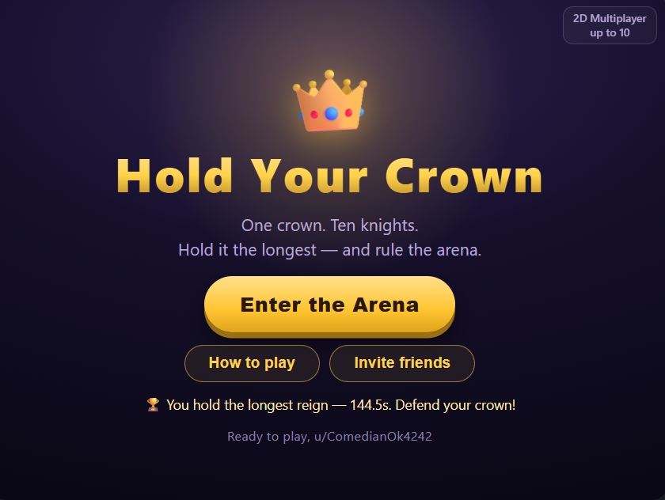
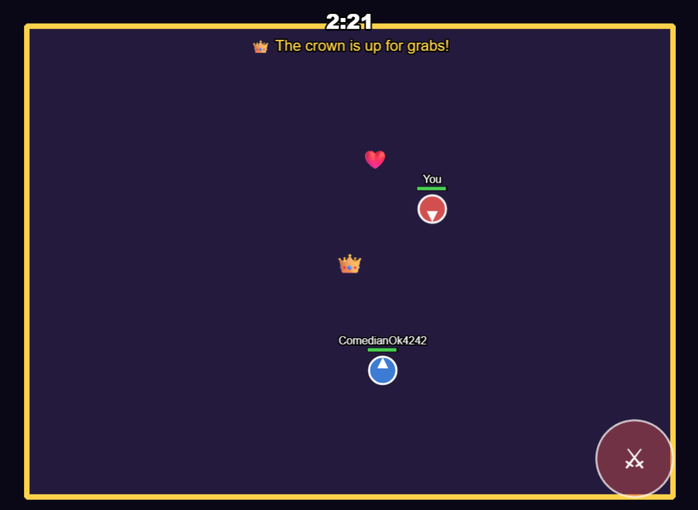

# Hold Your Crown

> A real-time 2D multiplayer battle for a single crown, played live inside a Reddit post. Ten knights, one crown — grab it, defend it, and hold it longest to be crowned king. The whole lobby is coming for you.

**Play:** [r/HoldYourCrown](https://www.reddit.com/r/HoldYourCrown/) · **Demo post:** _(add link)_ · **Video:** _(add link)_



---

## The Hook

Most Reddit games bring you back with new content — a new puzzle, a new prompt, a new day. Hold Your Crown brings you back with a **rival**.

It is a live, top-down 2D arena where up to 10 real Redditors (knights) fight over one crown — and whoever holds it longest is crowned king. The moment you take it, a timer starts and everyone else in the room turns on you. Hold it and your reign climbs; lose it and you want it back. There is no content to wait for — the reason to return is the rematch.

- **Short rounds, high frequency.** A round is three minutes. It is built for "just one more."
- **A villain every match.** Whoever wears the crown becomes the shared target — the lobby unites against the leader, then fractures the instant it drops. That drama is emergent and different every time.
- **Skill you can feel improving.** Reading the fight, timing a swing, stealing the crown at the right moment — it rewards getting better, which is what keeps competitive games alive.
- **A record to chase.** Every reign is banked to a persistent leaderboard, all-time and daily. The post itself shows the longest reign yet ("can you beat it?"), and your results screen shows your personal best and rank — so there is always a number to beat and, once you top it, to defend.

This is retention through **people**, not through a content treadmill. The hook is the oldest one there is: someone else is holding the thing you want.

## Why this belongs on Reddit

Reddit is live, communal, and competitive. Across recent Devvit games there are plenty of daily puzzles and idle or collaborative apps — and almost no **real-time, head-to-head** ones. A Reddit post that turns into a live arena where the crowd piles on the leader is community in motion: meritocratic, social, human-first. It is "Reddit-y" in spirit, without leaning on karma, Snoo, or subreddit in-jokes.

## How to play

1. Open the post and hit **Enter the Arena**.
2. You land in a **lobby** with everyone else waiting; a short countdown fills the room (up to 10 players).
3. When the round starts, **grab the crown** in the center.
4. **Hold it** — your reign time ticks up while everyone tries to take it.
5. Get knocked out and the crown drops where you fell; anyone can steal it.
6. After three minutes, **the most total crown-time wins.**

Move with WASD / arrow keys or the on-screen joystick and attack with the sword button or space. **Special drops appear in the arena — health to heal, shields to soak the next few hits** — so a sharp player can outlast the whole crowd and defend a long reign. It plays on desktop and mobile.



## Under the hood: real-time multiplayer with no game server

The hard part of this project is not the swordplay — it is running a fast, consistent, real-time game on a **serverless platform with no always-on process and no server tick.** Devvit gives you request handlers, Redis, and a realtime relay; nothing that loops 60 times a second. Hold Your Crown is designed around that constraint:

- **Client-broadcast state.** Each player simulates only themselves and broadcasts their state ~16 times a second; the server relays it over Devvit realtime. Everyone renders everyone else as a smoothly interpolated remote. No authoritative server loop needed.
- **Single-owner facts are atomic in Redis.** There is exactly one crown. Claiming it is an atomic `hSetNX` per generation, so two players grabbing the same loose crown can never both win — the race resolves in a single Redis operation.
- **Self-healing crown ownership.** Who holds the crown is *derived every frame* from the 16 Hz state stream, not from a fragile one-shot "taken/dropped" event. If a packet is ever lost, the next state broadcast reconciles every client within ~60 ms. This eliminated an entire class of desync bug.
- **Time from a shared anchor.** Lobby countdowns and the three-minute round are computed from one stored `createdAt` plus each client's measured clock offset, so every player's clock ends together with nothing ticking it down server-side.
- **Multi-room matchmaking.** Rooms cap at 10 via an atomic slot counter over a sorted-set room registry, with a rejoin pointer so a refresh never burns a seat. An 11th player simply opens a fresh room.

Combat, knockback, death and respawn, pickups, and the kill feed all ride the same model: the victim is authoritative over its own health, so there is no trust problem and no rollback.

```
   Player A              Player B              Player C
 (Phaser client)       (Phaser client)       (Phaser client)
     |    ^                 |    ^                 |    ^
 POST|    | realtime    POST|    | realtime    POST|    | realtime
state|    | (fan-out)  state|    |            state|    |
     v    |                 v    |                 v    |
  +--------------------------------------------------------+
  |              Devvit server (Hono, /api)                |
  |   relay state  ------------------>  Devvit realtime    |
  |   crown claim / rooms / presence -> Redis (hSetNX, zset)|
  +--------------------------------------------------------+
```

## Built with Phaser

The whole client is Phaser: arcade-physics movement, a `FIT`-scaled 1024×768 arena so coordinates stay constant on every screen size, a custom touch joystick and attack button for mobile, sword-arc hit detection, tweened combat feedback, and frame-rate-independent easing of remote players. Phaser handles the rendering and the feel; the engineering challenge is keeping it in sync across an unreliable relay.

## Tech stack

| Layer       | Technology                                      |
| ----------- | ----------------------------------------------- |
| Platform    | Devvit Web (Reddit Developer Platform)          |
| Game engine | Phaser                                          |
| Realtime    | Devvit realtime (client-broadcast relay)        |
| State       | Redis (atomic claims, room registry, presence)  |
| Server      | Hono                                            |
| Build       | Vite                                            |
| Language    | TypeScript (strict)                             |

## Project layout

```
src/
  client/            Phaser game (webview)
    scenes/          Boot, Preloader, Lobby, Game, GameOver
    scenes/entities/ Knight (player/remote sprite + hp/shield/crown)
    net/             Net — realtime connect + POST helpers
  server/            Hono app on Devvit
    routes/api.ts    join / lobby / state / attack / crown / pickup / kill / score / leaderboard / profile
  shared/            Types + constants shared by client and server
```

## What's Next

The competitive core is complete; the next layers deepen the hook:

- **AI knight opponents to fill quiet rooms.** Bots that navigate the arena, contest the crown, and fight — so a room with only one or two real players still feels alive, then step aside as more humans join. This is the key to a strong experience at low player counts (including a judge who lands on the post alone). The host-authoritative networking to drive them is already in place; the remaining work is smarter, calmer AI so they play like real opponents rather than swarm.
- Player levels and XP progression layered on top of the existing profile stats
- Seasons and unlockable crowns as long-term goals to chase
- More special drops — speed boosts, temporary swords, and traps to shake up each round
- Spectate and one-tap rematch

## Getting started

Requires Node 22+ and a Reddit account connected to [Reddit developers](https://developers.reddit.com/).

```bash
npm install
npm run login      # log the CLI into Reddit
npm run dev        # playtest live on a test subreddit
```

### Commands

- `npm run dev` — live playtest on Reddit
- `npm run build` — build client and server
- `npm run type-check` — type-check the project
- `npm run deploy` — upload a new version
- `npm run launch` — publish the app for review

## Credits

Built on Devvit Web and the Phaser + Vite template. Thanks to the Reddit Developer Platform and Phaser teams.
